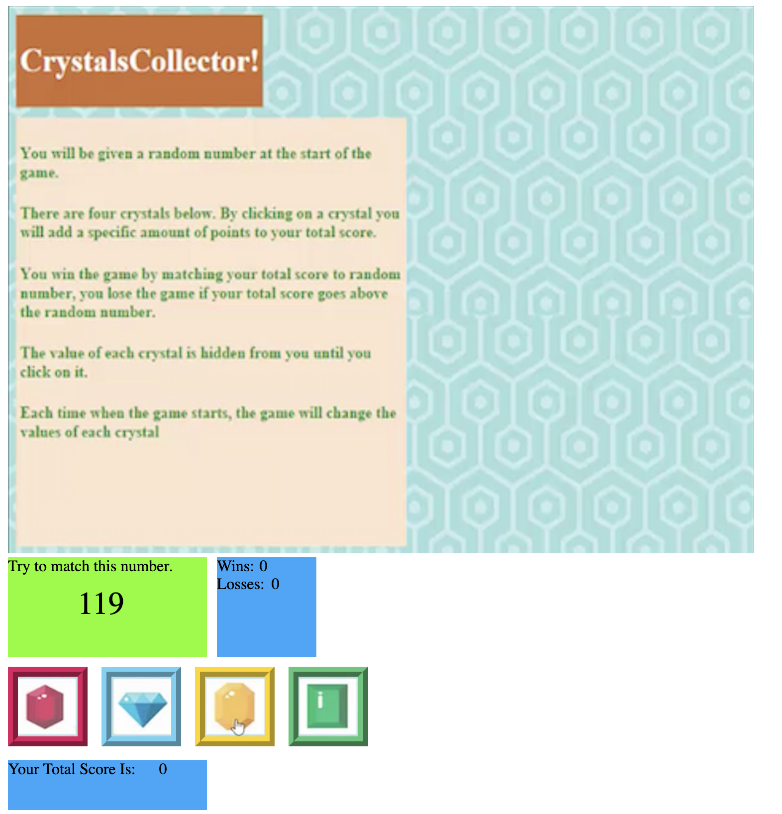

# Unit-4-Game

## Page preview: 

## Page-preview for "Cheat-Mode" section. Turned off for deployment

## About the project:

We had to build a game where the user clicks on one of 4 gems, each assigned with a random point value at the beginning of the game. Each click adds up the points in a total score box. The user must match the total score with a randomly chosen number shown at the beginning of the game. If they hit that number they win and if they go over they lose. They can't see what each gem is worth so the object is to keep track of each gem's point value in order to add up their total score exactly to match the random number. Wins and losses are tracked

## Techologies used to build:
  * HTML
  * CSS
  * jQuery
  * Javascript

## Methodology:

I used math.floor-math.random to generate the random numbers for the computer guess and the gems. The gems were pretty strait forward but the computer guess was tricky because the random number has to be btw 19 and 120. I looked up methods on-line for that and found several copde snippets, however, I didn't want to just copy-paste other peoples' snippets for this. I want top try an come up with one myself. Till then, I went the long way which is to create an array of numbers btw 19-120 and have the method choose from the array. If I can come up with my own formula, I will update and push up to GH.

I made a function top generate the numbers to start the game and another function to reset the game when the game over conditions are met. 

I built the page structure in HTML by taking separate screen-shots of the gems plus the background from the screen-shot given to us in the homework instructions. I used the gem screen-shots to create buttons for the gems. I used css to place the images accordingly on the page.

I also made a cheat-mode for developement so I can see the random numbers for the gem. It's turned off but If you want to see the gem point values, just go to the css file and comment out the display: none;

.num-test {
  margin-top: 75px;
  display: none;
}

The second js file called gameTest is used for testing.

